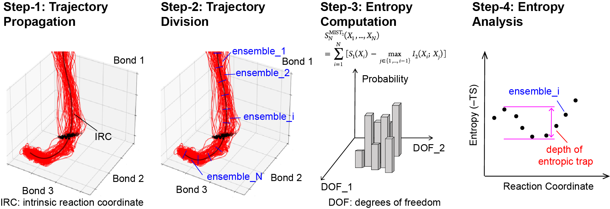

# Entropic_Path_Sampling
The repository documents how to perform entropic path sampling method to evaluate the entropic path along a reaction path. The model reaction is cyclopentadiene dimerization.

